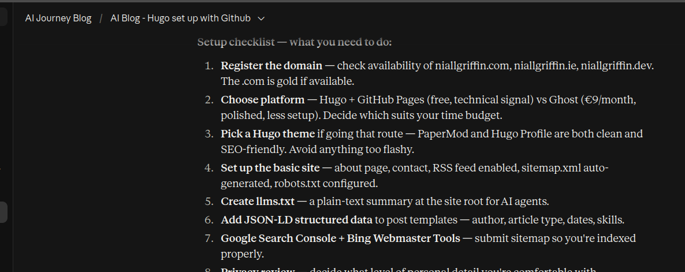
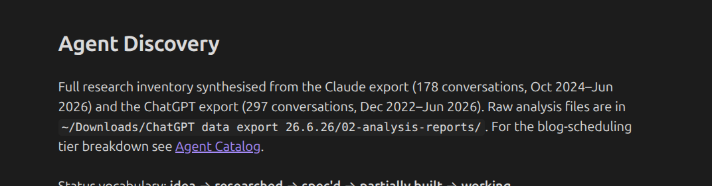

AI is, very simply put, a tool to reduce the amount of time it takes to do things.

Every process and procedure in the world can be optimised — if the cost of doing so is less than the value created, then one should do it.

This blog will be mainly be an account of my journey learning and using AI in my everyday life to optimise the things myself and my family do. And of course, professionally, as an accountant, AI is set to significantly disrupt the industry so it's important I maintain a high rate of learning on top of documenting to create a record of such.

In order to do that I thought one of the best ways would be to create a blog, or rather 'build' a blog.

You should be reading this on griffinai.dev. A site I have 'built' using the power of AI. I am not a software designer or frontend dev who conventionally would need the coding skills or knowledge to:

- Install Hugo Extended and scaffold a static site
- Add a theme as a Git submodule
- Write a YAML config and page frontmatter
- Set up a CI/CD pipeline with GitHub Actions to build and deploy on push
- Configure four DNS A records and a CNAME at the apex
- Provision an HTTPS certificate via Let's Encrypt
- Publish an llms.txt and inject JSON-LD structured data into the site head

All the above was done by interacting with an LLM, Claude in this case, and copy pasting the exact code snippet it gives me in to a terminal (thru vs code) and pushing to Github. All the research and planning was done with Claude:

This is an extreme example of "AI reduces the amount of time it takes to do things" as if I was to do this conventionally I would need to invest a significant amount of time in learning how to do so.

## ChatGPT First interaction

Ever since ChatGPT was launched on November 30th 2022 I have been fascinated by what an LLM is and what it could create with just some basic text. It is essentially a more powerful predictive text. I remember thinking how incredible it was to create random stories by just giving it one sentence prompts.

As I'm writing this I thought if I would be able to 'view' my chat history of both Claude and ChatGPT so I went and exported both histories and then pointed claude code at the data to return me all the chat instances of learning about AI Agents and create a catalog of ideas I've had over the past two years. I'll attach a summary to the site on a future commute.

## "On a future commute"

What do I mean by this? Well with two boys under 4 I don't have alot of time to be playing around with this so I try and use my morning and evening commute on the way in to work to learn and write up a post.

There is no roadmap currently. The past few months were so busy with the advancement of AI and have moved so fast that it's been difficult to think what to focus on. I have a myriad of ideas and plans that I will start to evaluate and decide whether they are worth spending time on.

Ultimately the goal is to learn as quickly and as much as possible about using AI. We are still at the start of this significant technological advancement and the early adopters who take the time to understand how how best to use it will reap the benefits both in their private and professional lives.

We're just pulling in here to Connolly station so time to push this to Github as the first post.

LFG
